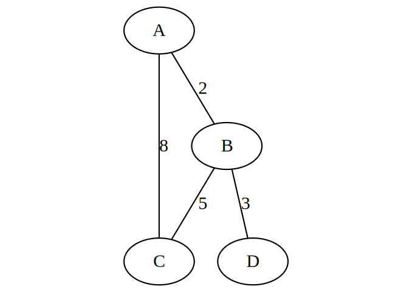

# traffic-infrastructure-planning
[Algorithms and Data Structures] C++ software package with command-line interface implementating undirected weighted graphs using adjacency matrix representation, as well as some of the most commonly used algorithms.

Homework/project in **Algorithms and Data Structures (13E112ASP)** at University of Belgrade, School of Electrical Engineering.

## graphs.cpp (dz1)

This C++ program illustrates working with undirected weighted graphs. The program allows users to: create/delete a graph, add/remove vertices, add/remove edges, and print graph representation (adjacency matrix). Also, some of the most commonly used graph algorithms are implemented - Breadth First Search (BFS), Depth First Search (DFS), Kruskal's minimum spanning tree algorithm, and Floyd–Warshall shortest paths algorithm.

* Graph representation (`class Graf`)
* BFS (`void Graf::BFS()`)
* DFS (`void Graf::DFS()`)
* Kruskal's algorithm (`void Graf::kruskalov_algoritam()`)
* Floyd's algorithm (`void Graf::flojdov_algoritam()`)

### Example



* Graph representation

After creating the graph (CLI option `1. Kreiraj graf`), adding vertices (CLI option `2. Dodaj cvor u graf`) and edges (CLI option `4. Dodaj granu izmedju dva cvora`), we get the following graph representation using CLI option `6. Ispisi reprezentaciju grafa`:

```
       A   B   C   D
   A   0   2   8   -
   B   2   0   5   3
   C   8   5   0   -
   D   -   3   -   0

Cvor A je povezan sa cvorovima: B(2) C(8)
Cvor B je povezan sa cvorovima: A(2) C(5) D(3)
Cvor C je povezan sa cvorovima: A(8) B(5)
Cvor D je povezan sa cvorovima: B(3)
```

* BFS

For this example, Breadth First Search (CLI option `10. BFS pretraga`) prints the following output:

```
A B C D
```

* DFS

For this example, Depth First Search (CLI option `11. DFS pretraga`) prints the following output:

```
A C B D
```

* Kruskal's algorithm

For this example, Kruskal's minimum spanning tree algorithm (CLI option `8. Kruskalov algoritam`) prints the following output:

```
A-B (2)
B-D (3)
B-C (5)
```

* Floyd's algorithm

For this example, Floyd–Warshall shortest paths algorithm (CLI option `9. Flojdov algoritam`) prints the following output:

```
       A   B   C   D
   A   0   2   7   5
   B   2   0   5   3
   C   7   5   0   8
   D   5   3   8   0
```

## metro.cpp (dz2)

This C++ program uses previously implemented graph algorithms and enables users to plan building road infrastructure with minimal cost. In addition to earlier algorithms, this program also uses Prim's minimum spanning tree algorithm, and Dijkstra's shortest paths algorithm.

* Prim's algorithm (`int Graf::primov_algoritam()`)
* Dijkstra's algorithm (`void Graf::dajkstrin_algoritam()`)
